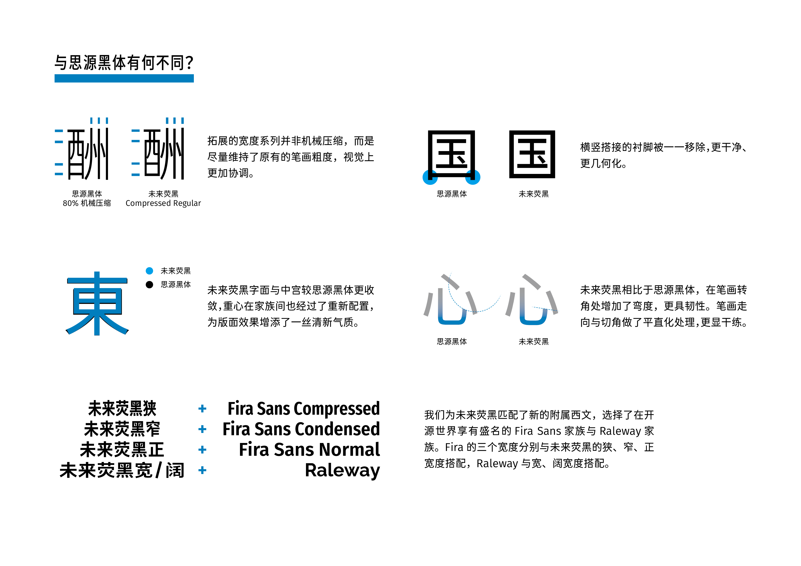

# ヒカリ角ゴ・未来荧黑・未來熒黑・Wêlai Glow Sans

ヒカリ角ゴは、[源ノ角ゴシック](https://github.com/adobe-fonts/source-han-sans)、[Fira Sans](https://github.com/mozilla/Fira)、[Raleway](https://github.com/impallari/Raleway)に基づくオープンソースCJK統合漢字フォントプロジェクトで、簡体字中国語（SC）、繁体字中国語（TC）、および日本語（J）をサポートしています。 フォントファミリーには5つの幅と9つのウェイトがあり、あわせて44個のフォントからなっています。

源ノ角ゴシックと比較して、ヒカリ角ゴはより簡潔で現代的な外観と、より緩和した組版効果を特徴としています。 ふところと字面が狭くなります。 漢字の重心は、ファミリ全体で再配置されます。 筆画の詳細は、より平坦になるように調整されます。 詳細な書体デザインのプレビューについては、[書体見本](../tests/family-specimen.pdf)をご覧ください。

<!-- Implementation of Glow Sans is somewhat between parametrization and contour filters, utilizing image processing techniques for glyph modeling. Digital typeface designing programs are not necessary for building the Glow Sans fonts, instead, [an interactive visualization Web demo](https://welai.github.io/glow-sans) is developed for parameter adjustment. -->

## ダウンロード

フォントのダウンロードに関する情報は、[GitHub Release Page](https://github.com/welai/glow-sans/releases)にて公開されます。

## オンラインデモ

ヒカリ角ゴのパラメーターをインタラクティブに調整できる[オンラインデモ](https://welai.github.io/glow-sans)が開発されています。 パラメーターをエクスポートして、フォントのビルドに使用することもできます。

## 源ノ角ゴシックとの違い

ヒカリ角ゴは、7つのフォントからなる源ノ角ゴシックを44フォントにまで拡張し、ウェイトと幅を豊かにしました。
<!-- Han ideographs' structures and strokes are both modified. -->また、欧文書体についても新たなマッチングを行いました。

## よくあるご質問
* **Q:** ヒカリ角ゴは無料で商用利用できますか？
<!-- Is Glow Sans free for commercial uses? -->
* **A:** 可能です。ヒカリ角ゴはSIL Open Font License 1.1に基づきリリースされています。
<!-- Yes. Glow Sans is released under SIL Open Font License 1.1. -->
* **Q:** ヒカリ角ゴはバリアブルフォントですか？
<!-- Is this a variable font? -->
* **A:** 違います。
<!-- Glow Sans makes modifications to Source Han Sans to achieve goals like deforming glyphs and extending the font family. -->
源ノ角ゴシックがバリアブルなバージョンを公開しておらず、元のデータを利用することができないためです。ただ、書体の幅の軸を設けることにより、バリアブルフォントをビルドできる可能性はあります。[オンラインデモ](https://welai.github.io/glow-sans)を確認することで、ヒカリ角ゴの仕組みをさらに知っていただけると思います。

<!-- No. Glow Sans makes modifications to Source Han Sans to achieve goals like deforming glyphs and extending the font family. Since Source Han Sans did not release a variable version, its master data remains inaccessible. Though there is still a possibility to build variable fonts with a width axis. For better understanding how Glow Sans works, please check out our online [demo](https://welai.github.io/glow-sans). -->
* **Q:** ハングルはサポートされていますか？
<!-- Is Hangul supported? -->
* **A:** 現時点ではまだです。のちにサポートされるかもしれません。
<!-- No. Perhaps later. -->
* **Q:** Seems that the glyph contours are not in good quality.
* **A:** Algorithms are not perfect. Glow Sans is only trying to offer a free substitution for modern style CJK sans-serif typeface with width variations. Anyway, improving quality of the output contours is an important technical goal.
* **Q:** ある特定のグリフを修正してもよろしいでしょうか？
<!-- Would you mind fixing some specific glyph? -->
* **A:** 申し訳ありませんが、それは許可できません。問題があれば、コードを修正することで解決します。プルリクエストは歓迎です。
<!-- Sorry, I wouldn't. I would solve the problems if and only if I could solve it with codes. Pull requests are welcomed. -->
* **Q:** TTFのバージョンは利用可能ですか？
<!-- Is a TTF version available? -->
* **A:** 現在はできません。おそらく、次のバージョンで可能になると思います。
<!-- Currently no. Perhaps the next version -->
* **Q:** Why are some characters not supported while they are avaible in Source Han Sans?
* **A:** The corresponding glyphs are too difficult to be compressed or extended, so they are temporarily removed. Besides, `ccmp` feature is not yet supported either, and we do not have any plan to include `locl` features for CJK ideographs.

## ビルド
フォントをビルドするための指示書、ならびにデモについては、[build-instructions.md](build-instructions.md)をご確認ください。

## ライセンス
© 2020 Project Wêlai

開発者: [Celestial Phineas](https://github.com/celestialphineas)

ヒカリ角ゴは[SIL Open Font License 1.1](../OFL.txt)のもと公開されています。また、ソースコードは[MIT License](../LICENSE)です。

## コントリビューター
ヒカリ角ゴへのコントリビューターの皆様へ、この場をお借りして感謝申し上げます。お名前はアルファベット順に列挙しています。

[@cathree3](https://github.com/cathree3), [@floating-cat](https://github.com/floating-cat)

## 外部リンク
* [NextLab, Zhejiang University](http://www.next.zju.edu.cn)――私たちのグループは、中国語のタイポグラフィー・デザインやカリグラフィに情報処理技術を応用することを目指して尽力しており、未来の中国語の書体デザインの可能性を拡げてゆきます。
<!-- our group is making efforts to apply computing techniques on Chinese typographic design and calligraphy, as well as exploring possiblities for future Chinese typographic design. -->